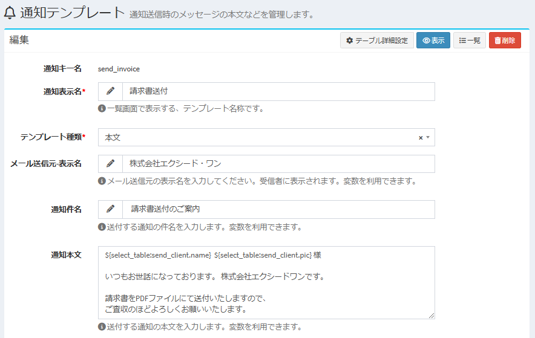
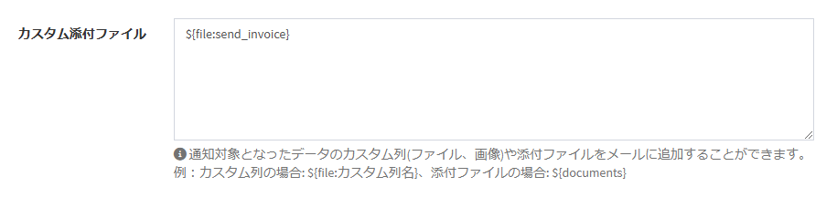
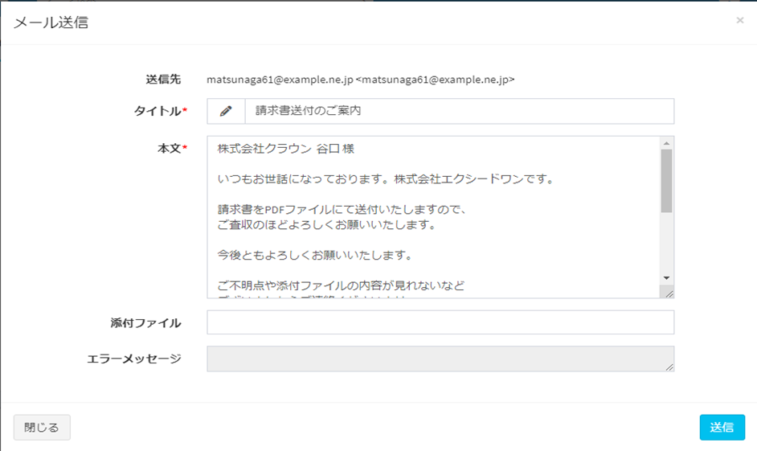

# PluginInvoiceDocument - 請求書のPDF出力。  
テンプレートで請求書をEXCEL形式で出力します。合わてEXCELファイルをPDFへ変換します。

## 主な機能

- 請求書テーブルの詳細画面に「請求書出力」ボタンを表示します。
- ボタンをクリックすると、請求書（EXCEL）が添付ファイルに追加されます。  
合わせてPDFに変換したファイルが請求書（PDF）列に登録されます。

## 事前準備

### テンプレート導入

- サンプルテンプレートをダウンロードします。  
[サンプルテンプレート](invoice_template.zip)  
このテンプレートは、対象テーブル名が「send_invoice」「send_invoice_detail」「send_client」であることを前提に作成されています。  
そのため、システム上にそられのテーブルが既に存在する場合は、テンプレート内のテーブル名を適宜修正してください。

- 管理者設定＞テンプレートから対象テンプレートのアップロードを行ってください。  

## 実行方法

- 通知テンプレートを作成します  
※請求書をメール送信する際のテンプレートです。お好きな内容を登録してください

※カスタム添付ファイルに必ず<strong>${file:send_invoice}</strong>を設定してください

- 請求書テーブルに通知を作成します

- カスタムフォーム優先度設定を追加します

- 請求書テーブルにデータを作成します  
※事前に取引先を登録しておく必要があります

- データ詳細画面で<strong>「請求書出力」</strong>ボタンを押下します

- 請求書（EXCEL)が添付ファイルに追加されます  
合わせてPDFに変換したファイルが請求書（PDF）列に登録されます  
※請求書出力ボタンを押すたびに最新の情報で作成したEXCELが添付ファイルに追加されますが、PDFは常に最新のバージョンのみ保持します

- 「請求書送付」ボタンを押すと最新のPDFを添付した状態で取引先にメールが送信されます。

